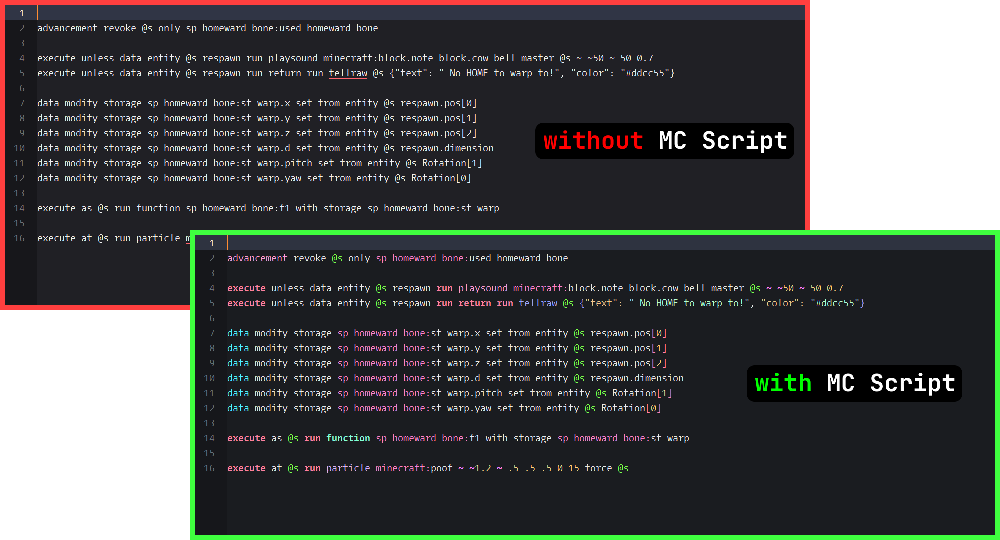
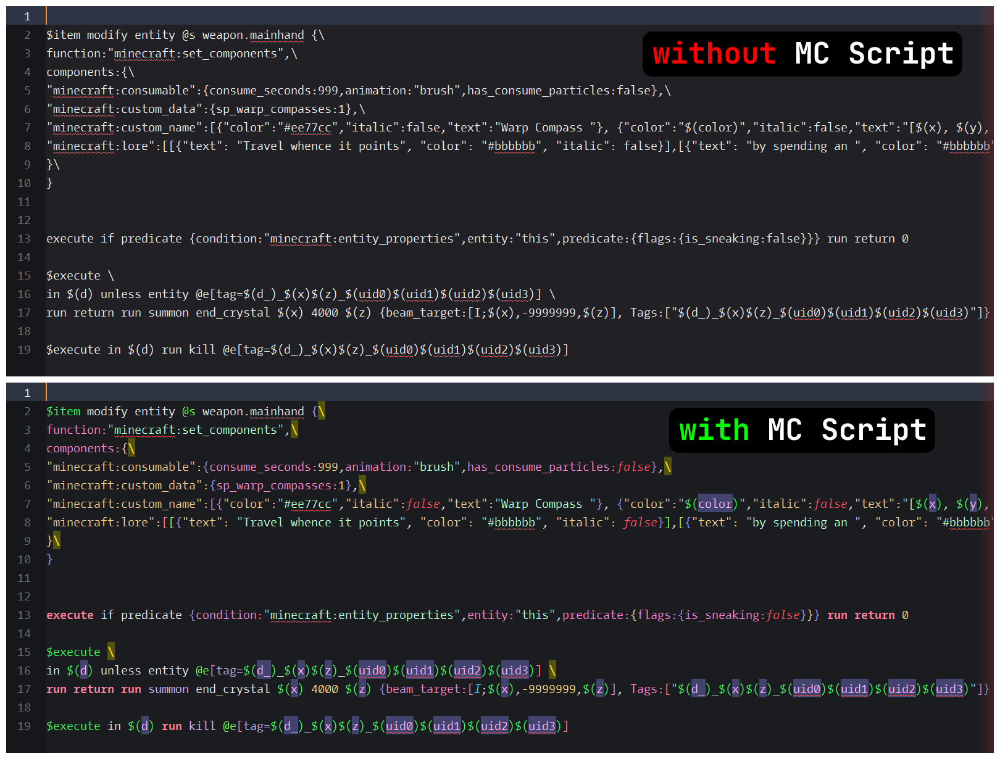

# Minecraft Script

### `.mcfunction` Syntax Highlighter for Sublime Text

## About
A Sublime Text custom syntax package for highlighting Minecraft commands inside `.mcfunction` files.

Also works with `.mcs` and `.mcf` file extensions for convenience sake.

## Installation
Place the `Minecraft Script` folder inside your Sublime Text Packages directory.

Example path after correct installation on Windows:
> C:\Users\USER\AppData\Roaming\Sublime Text\Packages\Minecraft Script\
